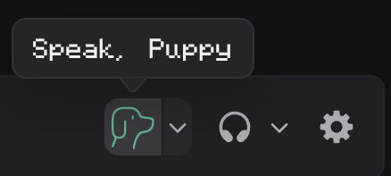
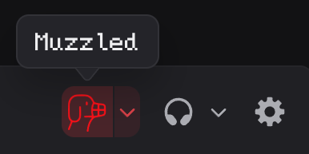

plugin developed for vencord/vesktop, may work elsewhere but not guaranteed

install via dropping the following oneliner into your quickcss or active theme:

`@import url("https://raw.githubusercontent.com/laikadoggirl/muzzlemute/refs/heads/main/MutedToMuzzled.css");`
:dog2:

## Images

